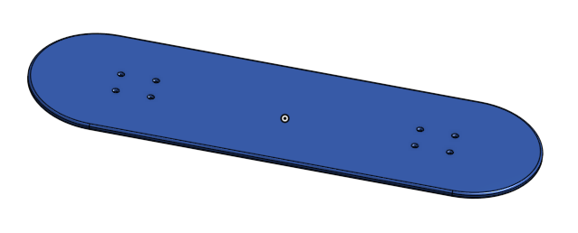
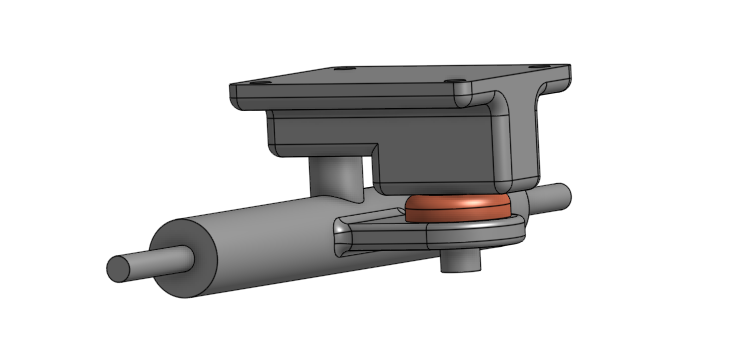
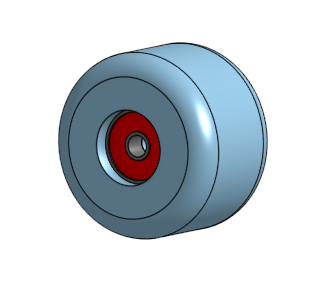
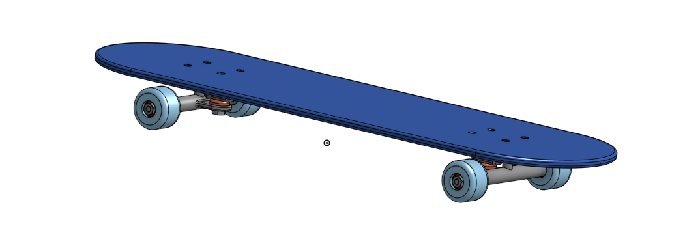

# CAD-Engineering3

## Table of Contents
* [Table of Contents](#TableOfContents)
* [Skateboard](#Skateboard)

## Skateboard
The Skateboard is designed on Onshape by combining a deck, trucks, wheels, and bearings. It is then assembled all together.

[Link to Onshape Document](https://cvilleschools.onshape.com/documents/43ac334ecc19ff8ab6669fec/w/b0ce2447437d1404e49dbab2/e/44c58274e30f4a2979bdd1af)

### Deck

#### Description
The Deck is designed by a rectangle and circles, and is extruded. Holes are poked in the deck symmetrically for screws; it was then named, assigned the material Hard Maple, and colored blue.

#### Images

#### Reflection
* The instructions for the deck taught me to use the hole tool
* I learned about ways to use symmetry, and using the rectangle shape to outline spaces for other features.

### Trucks

#### Description
The Trucks are made from 3 different parts combined: The baseplate, the hanger, and the bushing. The baseplate is a flat structure with holes and extensions that connects directly to the deck, and lends support to the axle. It has a pin sticking out of it which the bushing and the hanger are connected to. 
The Hanger is the main axle which the wheels go onto.
The Bushing is a polyurethane ring to provide a shock support and bend to the board.
The Truck hanger and baseplate are made of stainless steel.

#### Images

#### Reflection
* I learned how to add extrusions from different parts from the original sketch.
* The assembly was difficult, because of weird sketch problems, and incorrectly centered things.

### Wheels_and_Bearings

#### Description
The wheels and bearings were both created by first designing a section view sketch, and using a revolve feature to make it circular. The bearing is extruded as a separate part from the wheel.

#### Images

#### Reflection
* This one was pretty simple, because of how easy the revolve tool is to use. 
* The revolve tool was new, but very helpful.

### Assembly

#### Description
The assembly consisted of using mate connectors to put all the different parts together. Most connections were via fastened mates, besides the one between the axle and the bearings. Combined, 8 bearings were imported, 4 wheels, 2 trucks, 1 deck, 8 small screws, 8 small nuts, as well as 4 other nuts for the wheels and 2 for the king pin of the trucks.

#### Images

#### Reflection
* At first, it was difficult to figure out the mate connectors again.
* The k hotkey was helpful to clear the view (it hides all mate connectors).
* The final assembly looks good, but without the bend in the deck, it looks pretty unrealistic.
